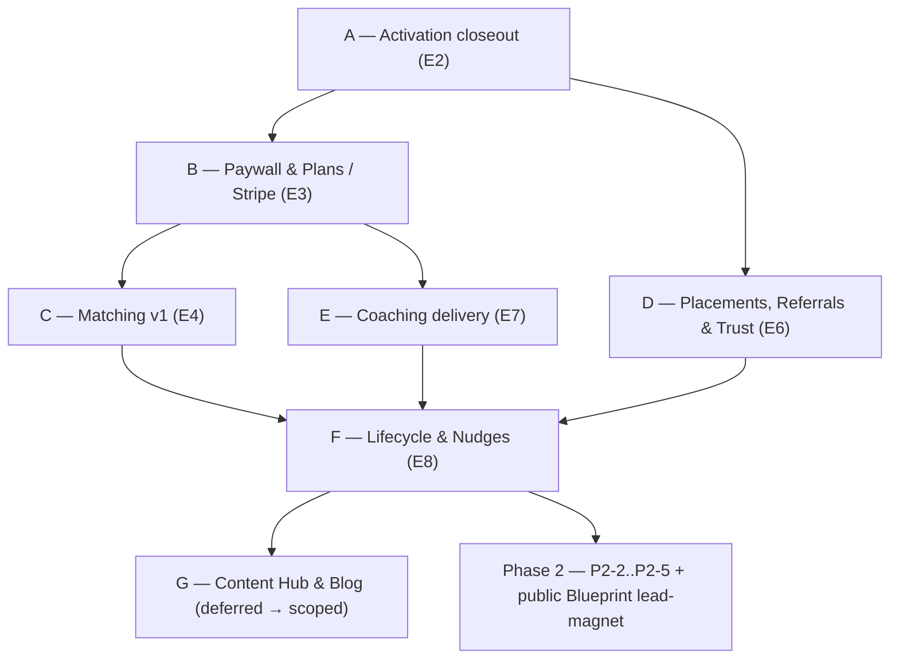

# Empowered Careers — Sprint Checklist to Finished Product

> Status: **Active** (created 2026-06-05)
> Single source-of-truth backlog from today's verified state to a finished product —
> Phase 1 launch, Phase 2, and the explicitly-deferred items folded in as real sprints.
> Supersedes the stale checkboxes in `docs/ec-dev-plan.md` (kept as historical narrative).
> Legend: `[x]` shipped & code-verified · `[ ]` pending · `[~]` partially built (note inline).

---

## How this doc was built

Every `[x]` below traces to a real route/action/hook/migration in the repo as of 2026-06-05.
Every `[ ]` traces to a confirmed gap (e.g. no Stripe SDK, `matches` table never written, no
`candidate.*` Loops events, static `SocialProof.tsx`, `TODO(coaching)` stubs). The dependency
diagram (§3) is the build order; never start a sprint whose prerequisite is later.

---

## 1. Already shipped (the floor we build on)

- [x] Auth — Google + LinkedIn OAuth + email/password; OIDC `iss`/`sub` identity hardening; role guards (`requireAdmin`/`requireEmployer`).
- [x] Onboarding + `candidate_preferences` capture; soft-gate redirect on `onboarding_completed_at`.
- [x] Profile surface (`/profile`) + profile-completeness ring (`getProfileStrength` in `use-dashboard-data.ts`).
- [x] Resume pipeline — upload + file-hash dedup → Inngest `parse-resume` (Claude parse + score) → `resume_score`, `parsed_json`, supersession, retry UX.
- [x] LinkedIn pipeline — OAuth identity sync + PDF-export parse/score via Inngest `parse-linkedin`; OAuth fields preserved.
- [x] **Career Identity Blueprint assessment** — 30-Q runner + deterministic scoring → `candidate_scores` (6 dims) + display blob (`docs/done/career-blueprint-integration.md`, shipped 2026-06-02).
- [x] Job board — `/job-board` browse + filters + tier locks via `canSeeJobTier`; `/job-board/[id]`; `/job-board/saved`; express-interest with PII consent.
- [x] Candidate pipeline — `/pipeline` kanban (8 statuses), withdraw, `useApplicationNotifications`.
- [x] Admin console `/admin/*` — jobs, candidates(+detail), applications kanban, placements, commissions, payments ledger, employers (+invite), coaching products, events, leads, overview.
- [x] Employer portal `/employer/*` — jobs CRUD, applications (+full-PII detail + status mover), client_companies (agency), placements; `useEmployerApplicationNotifications`.
- [x] Events + leads — public `/events`, registration, lead reconcile at OAuth, `lead.*` Loops events.
- [x] Realtime notifications provider (resume / linkedin / application hooks in root layout).
- [x] SEO — sitemap, `llms.txt`, robots, JSON-LD, canonicals.
- [x] In-app nudges **v1** — `computeNudges()` (3 hardcoded rules) feeding the dashboard "For your attention" grid.

---

## 2. Open decisions (resolve before the dependent sprint)

| # | Decision | Blocks | Notes |
|---|----------|--------|-------|
| D1 | **Gating rule:** `context.md` / `ec-candidate-journey.md` say *"any payment = lifetime Tier 3."* `ec-dev-plan.md` S3 says *"à la carte grants Plan 1."* These conflict. | Sprint B | Pick one and make `canSeeJobTier` + the webhook plan-setter agree. |
| D2 | **Coaching host** (Kajabi vs Teachable) + **Cal.com** account for 1:1 booking. | Sprint E | Drives the progress webhook + booking embed. |
| D3 | **Content engine** — MDX-in-repo (`docs/deferred/ec-blog-mdx-plan.md`, already speced) vs external CMS. | Sprint G | MDX plan is ready to execute. |
| D4 | **Tier-1 sourcing** — Lauren manual curation vs lightweight RSS/Greenhouse importer. | Sprint A (ops) | Affects whether the 10–15 roles/month gate is manual. |

---

## 3. Build order

---

## Sprint A — Activation closeout (E2 remainder)

Goal: a real candidate completes signup → resume → first value with no dead-ends. Small, unblocks the funnel.

- [ ] **Resume-before-dashboard hard gate.** Today only the preferences soft-gate exists; a user can reach `/dashboard` with no resume. Mirror the `onboarding_completed_at` redirect pattern in the `(app)` layer to require a current resume.
- [ ] **Surface LinkedIn `profile_score` badge** in the Profile Strength card (data exists; needs a query + render addition).
- [ ] **Stale-job watchdog** in `useResumeNotifications` + `useLinkedinNotifications` — flag rows stuck `uploading`/`processing` > 60s as `failed` (covers silent `inngest.send` failures).
- [~] **Nudge: resume_score < 70 → resume-review CTA** — extend the existing `computeNudges()` (`src/lib/dashboard/nudges.ts`); CTA target finalizes once Sprint B/E land.
- [ ] **Ops / manual:** `ANTHROPIC_API_KEY` local + prod; register Inngest prod endpoint + `INNGEST_EVENT_KEY`/`INNGEST_SIGNING_KEY`; promote Lauren to `role='admin'`; seed 10–15 Tier-1 roles; full end-to-end smoke test (`docs/todo.md`).
- [ ] *(optional)* Eval fixtures ≥5 per harness (`evals/*`).

**Exit:** signup → resume upload → resume score + Tier-1 roles visible, gated correctly.

---

## Sprint B — Paywall & Plans (E3, Stripe)  ⚠ largest gap

Goal: first dollar in. Nothing built today beyond the `payments` table + admin ledger + `grantPlan3()`.
**Resolve D1 first.**

- [ ] Add Stripe env (`STRIPE_SECRET_KEY`, `STRIPE_WEBHOOK_SECRET`, publishable key) to `env.ts` Zod schema.
- [ ] Create Stripe products/prices: Plan 1 (one-time), Plan 2 & 3 (monthly + annual), à-la-carte (resume review, LinkedIn audit, interview prep, coaching). Store `coaching_products.stripe_price_id`.
- [ ] Checkout Session server action; wire real checkout into `PricingTeaser.tsx` / a pricing page.
- [ ] `/api/stripe/webhook` route — handle `checkout.session.completed`, `customer.subscription.updated`/`deleted`, `payment_intent.succeeded`; write `payments` rows; set `profiles.plan` / `billing_cadence` / `subscription_status` / `stripe_customer_id`.
- [ ] `usePaymentNotifications` hook (per the CLAUDE.md async-job pattern) mounted in `RealtimeNotifications` — payment status flip → toast + invalidate.
- [ ] À-la-carte purchase → plan grant per **D1**.
- [ ] Subscription-management UI (view plan, cancel, change cadence) via Stripe billing portal.
- [ ] Nudge: viewing a locked tier → corresponding upgrade prompt.

**Exit:** candidate pays, plan persists, gating works end-to-end, Lauren sees the payment.

---

## Sprint C — Matching v1 (E4)

Goal: candidates see *why* a role fits. `matches` table exists but is never written; job board is browse-all.

- [ ] **`matches.match_score` writer** (the ATS score: resume-vs-job overlap + plan-visibility filter) — Inngest fn triggered on resume-parse-complete and on job publish.
- [ ] **`match_reasons`** — single-sentence "why this matches you" via Claude.
- [ ] `useMatchNotifications` hook mounted in `RealtimeNotifications`; toast new matches.
- [ ] Surface match score + reasoning on `JobCard` and job detail.

**Exit:** candidates see plan-appropriate matches with reasoning; expressing interest still writes `applications`.

---

## Sprint D — Placements, Referrals & Trust (E6 remainder)

Goal: close the flywheel and make the marketing page tell the truth. (Admin kanban + mark-as-placed already shipped.)

- [ ] **Real trust factors** — `SocialProof.tsx` hardcodes "100+"/logos. Feed real placement count + active-role-by-tier counts from DB via a server component.
- [ ] **Referrals** (enum exists, zero UI): candidate referral submit → `referrals` row + Loops invite; stamp `referred_profile_id` on signup and `placement_id` on placement (full attribution).
- [ ] **Success-story trigger** on `markAsPlaced` → `candidate.placed` Loops event (placeholder noted in admin actions).

**Exit:** placements are first-class and measurable; the marketing count is live data.

---

## Sprint E — Coaching delivery (E7)

Goal: what's sold can be consumed. Product CRUD + `enrollments` table exist; no candidate surface. **Resolve D2.**

- [ ] Enrollment grant from the Stripe webhook (Sprint B) on à-la-carte / Plan-3 purchase → `enrollments` row.
- [ ] Candidate **"My Coaching"** dashboard card + enrollment list page; wire the two `TODO(coaching)` stubs (`resume-client.tsx:411`, `linkedin-client.tsx:280`).
- [ ] External-host progress webhook (Kajabi/Teachable per D2) → `enrollments.progress`.
- [ ] Cal.com embed for 1:1 booking → webhook writes `coaching_sessions`.
- [ ] Admin: enrollment + session list per candidate (extends current coaching view).
- [ ] Nudge: enrollment unstarted > 7 days → re-engagement (Loops).

**Exit:** paid coaching has a consumption surface; Lauren sees engagement.

---

## Sprint F — Lifecycle & Nudges (E8)

Goal: Lauren stops manually chasing. Today only `lead.*` Loops events exist; nudges are v1 (3 rules).

- [ ] LinkedIn grade card (visibility score + keyword gaps) — extends the Sprint A badge.
- [ ] Resume-staleness tracking + nudge (60+ days since `parsed_at`).
- [ ] **Full `candidate.*` Loops event pipeline** — add wrappers to `src/lib/loops/client.ts` and fire from the relevant actions / Inngest fns / OAuth callback: `signup`, `resume_uploaded`, `payment`, `assessment_complete`, `plan_upgraded`, `job_interest`, `application_status_changed`, `placed`, `inactive_7d`, `inactive_30d`.
- [ ] Inactive 7d/30d detection — scheduled Inngest cron over last sign-in.
- [ ] Loops email sequences authored in dashboard (ops): welcome, resume nudge, profile completion, new match, upsells (resume<70, interview prep post-Tier-2 apply), weekly digest, inactive re-engagement, success-story.
- [ ] **Nudge engine v2** when ≥5–6 nudge types (`docs/deferred/ec-nudges-v2.md`): provider registry + `rank()` in `src/lib/dashboard/nudges/`; add `nudge_interactions` table only when dismissal/cooldown is needed.

**Exit:** every candidate has a personalized next action; sequences fire on behavior.

---

## Sprint G — Content Hub & Blog (deferred → scoped)

Goal: real content surface (currently `/blog` + Content Hub are placeholders). **Resolve D3.**

- [ ] Build the MDX blog per `docs/deferred/ec-blog-mdx-plan.md` (`next-mdx-remote/rsc`, `@tailwindcss/typography`, `content/` dir) + optional chat-authoring skill.
- [ ] Replace the placeholder `ContentClient` with real resources.
- [ ] Extend `sitemap.ts` + `llms.txt` + add `BlogPosting`/`Article` JSON-LD via the existing `JsonLd` component.

**Exit:** publishable content that feeds SEO and the funnel.

---

## Phase 2 — after the four gates hit

- [ ] **P2-2 Full matching** — weighted `job_scores` × `candidate_scores` dimensions; replace keyword overlap; A/B reasoning quality.
- [ ] **P2-3 AI tools** — AI resume rewrite, LinkedIn optimization, conversational assessments; wires the existing upsell CTAs.
- [ ] **P2-4 Pipedrive CRM** — migrate Google Sheets; bidirectional sync of employers / applications / placements.
- [ ] **P2-5 Expanded assessments** — the granular five (Role Clarity, Values, Strengths, Leadership, Big Wins) + Mindset/Saboteur + Communication; re-add `mindset_score` / `communication_score` to `candidate_scores`.
- [ ] **Public Career Blueprint lead-magnet** (`docs/deferred/career-blueprint-lead-magnet.md`) — anonymous funnel feeding `leads`.

---

## Cross-cutting (runs across all sprints)

- [ ] PostHog instrumentation — every nudge CTA, plan upgrade, application-status change.
- [ ] Playwright activation smoke test (signup → upload → resume score visible) by Sprint B.
- [ ] Adversarial RLS checks (`docs/todo.md`) — candidate JWT cannot insert jobs / read others' applications / self-promote status.
- [ ] Keep green: `npm run check` + `type-check` + `build` on every PR.

---

## Phase-1 gate tracker

| Gate | Target | Enabled by |
|------|--------|-----------|
| Free candidates in pool | 100 | Sprint A + content/events |
| Paid candidates | 30 | Sprint B |
| Employer/agency relationships | 3–5 | Lauren (employer portal shipped) |
| Exclusive roles / month | 10–15 | Sprint A ops + D4 |

All four green → Phase 2 begins.
